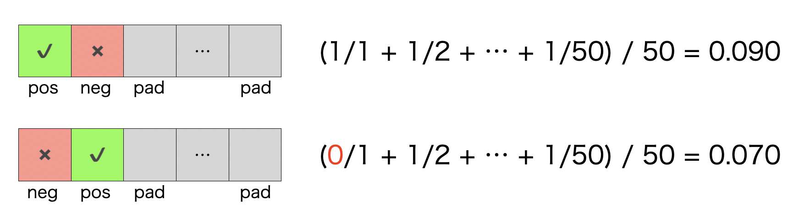
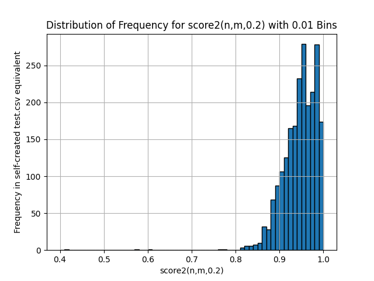

Thanks to the hosts for organizing this competition! I thoroughly enjoyed participating throughout the duration.

## Summary
An example of a query is as follows:
`(ti:composition ((detd:coox detd:pearly) OR (clm:dye detd:behentrimoinium))) OR (cpc:A61Q5/12 detd:artichoke detd:genaminox) OR detd:amidoquatsagain`
- Only `AND` and `OR` operators are used.
  - `AND` is implied and therefore omitted (https://www.kaggle.com/competitions/uspto-explainable-ai/discussion/516104)
- All fields are utilized in the query.
- The query format is `subquery_1 OR subquery_2 OR ... OR subquery_k`. The example query consists of four subqueries. The first two subqueries sharing `ti:composition` to save tokens:
  - `ti:composition detd:coox detd:pearly`
  - `ti:composition clm:dye detd:behentrimoinium`
  - `cpc:A61Q5/12 detd:artichoke detd:genaminox`
  - `detd:amidoquatsagain`
- For validation, I used a custom searcher implemented in C++ and an alternative metric.

## Terms
- Result Set: A list of patents returned from the custom searcher in response to a query. It is not limited to 50 items, and includes all patents that match the query in the index.
- AP'@50: the competition metric, is a flawed implementation of AP@50. (https://www.kaggle.com/competitions/uspto-explainable-ai/discussion/499981#2791642)
- Positive: Target 50 patents.
- Negative: All patents that are not Positive. These can be divided into two types based on whether they are definitely included in the test index or not.
  - Certain Negative: Negative patents that exist in test.csv (~12K).
  - Potential Negative: Patents that exist in patent_metadata.parquet but not in test.csv (~13M).
- Padding: Virtual patents added when the number of results is less than 50.

## Validation Strategy
As discussed in https://www.kaggle.com/competitions/uspto-explainable-ai/discussion/501169 , I considered creating queries using all the patents included in patent_metadata.parquet. However, it seemed impractical to create a Whoosh index that includes all 13 million patents, so I decided to use my own searcher and an alternative metric for validation.

To conduct the evaluation quickly, I added the following constraints:
- Constraint 1: Queries will not include proximity operators.
- Constraint 2: There will be no weighting of scores among patents that match the query.
- Constraint 3: Queries will not include wildcards.

Constraint 1 removes the need to consider the positions of words in the patents, Constraint 2 removes the need to consider the frequency of words in the patents, and Constraint 3 removes the need to consider the surface forms of words.

If only Positives (and Padding) exist in the Result Set, accurate AP'@50 can be calculated even with these constraints. For example, if Positives change from 0, 10, 20, 30, 40, to 50, the AP'@50 changes from 0 to 0.51, 0.76, 0.91, 0.97, and 1.0, respectively.

When Positives and Negatives are mixed, AP'@50 can only be approximated. For instance, with one Positive and one Negative (and 48 Padding), there are two possible patterns of results.

Due to Constraint 2, it is not possible to determine a single pattern for the result, so I assumed that all patterns appear with equal probability. The approximate AP'@50 score in this case is `(0.090 + 0.070)/2 = 0.080`. Similarly, for n Positives and m Negatives, $\binom{n+m}{m}$ patterns of results are possible. The score for n Positives and m Negatives was taken as the average AP'@50 of 100,000 patterns randomly sampled with replacement from all possible patterns (henceforth referred to as $\text{score1}(n,m)$).

The graph below shows the plotted scores.

For example, $\text{score1}(25,0)=0.842$ and $\text{score1}(50,50)=0.500$.

If only Positives and Certain Negatives are included in the Result Set, $\text{score1}$ can be used as is.

When Potential Negatives are included in the Result Set, the number of Negatives varies probabilistically. Assuming all Potential Negatives are included in the Result Set with probability p, the score can be calculated using the probability mass function (pmf) of the binomial distribution as follows:

$$
\text{score2}(n, m, p) = \sum_{k=0}^{m} \binom{m}{k} p^k (1-p)^{m-k} \text{score1}(n, k) 
$$

For example, $\text{score2}(50,50,1.0) = 0.500$, $\text{score2}(50,50,0.1)=0.910$, and $\text{score2}(50,50,0.01)=0.990$.

The validation score was calculated as the average $\text{score2(n, m, 0.2)}$ for each of the 2500 rows in the self-created test.csv equivalent. The total number of patents is approximately 13 million, and the number of Potential Negatives that could be included in the test index is around 75,000, so $p=75000/13000000 ≒ 0.006$ seemed appropriate. However, to avoid optimistic validation scores, $p=0.2$ was used.

The equivalent of the publication_number in test.csv was prepared as follows:
- 2500 patents since 1975 and `len(cpc_codes) > 0`

When the test index was created by simply filtering patents after 1975, the validation score and LB score seemed slightly off. Analyzing the published train index and LB revealed that design patents starting with US-D were rarely included in the train index and test.csv used for LB calculation. Upon investigating several design patents, I found that cpc_codes were often empty, so I added the filter `len(cpc_codes) > 0`. I also confirmed that patents with empty cpc_codes were not included in the publication_number column of LB's test.csv.

With the above modifications, the difference between the LB score and the validation score was generally within 0.01.

## Solution
- Phase 0: Preprocess
- Phase 1: Find subquery candidates
- Phase 2: Generate queries using beam search to maximize $\text{score2}(n, m, 0.2)$

To achieve fast execution speed, as with my own searcher, everything was implemented in C++.

### Phase 0: Preprocess
- The words that appear multiple times in the same patent were consolidated after tokenizing them in the same way as processed in whoosh_utils.py.
- Words containing wildcard characters were excluded.
- Words that appear only once across all patents were excluded.
- High-frequency words were excluded (e.g., words with a frequency of exceeding 400,000 in titles and 10,000 in descriptions).
- Words that do not appear in test.csv were excluded.
- The patent IDs were adjusted so that the IDs in test.csv are ordered earlier. This adjustment enables more efficient conjunctive subquery searches in the solver described later.
- Patents and all words were converted to IDs.

### Phase 1: Finding Subquery Candidates
- n-shot subquery
  - A subquery that narrows down to a specific single patent. For example, ti:margaric narrows down to US-2023092870-A1 because it is the only patent containing margaric in the title. Similarly, the cpc_codes A46B13/005 and A47L7/0061 co-occur only in US-2023025335-A1, so `cpc:A46B13/005 AND cpc:A47L7/0061` narrows down to US-2023025335-A1.
  - Pre-calculated and embedded.
    - Found that 5.9M patents could be narrowed down to one with a single token, and an additional 6.7M patents could be narrowed down with two tokens.
- conjunctive subquery
  - A subquery that includes multiple Positives, no Certain Negatives, and at most $l$ Potential Negatives.
  - Combination of 2-3 tokens using AND. 
    - Explored combinations of cpc_codes, words in title and abstract (frequency <=400,000), claims (frequency <=100,000), and description (frequency <=10,000) using DFS (Depth-First Search).
    - Explored most cases fully, but some were time-limited.
  - Avoided Certain Negatives as they significantly reduce the score and facilitate efficient DFS pruning.
  - Conducted beam search with $l=0$ and $l=1$ for Phase 2. This improved validation score by about 0.003.
  - Calculated on-the-fly rather than pre-calculating.

### Phase 2: Beam Search
The evaluation metric used was $\text{score2}(n, m, 0.2)$, and I performed beam search with a width $W$ for each number of tokens used. For the submission, I set $W=100$. Increasing $W$ slightly improved the validation score, but even increasing $W$ by a factor of 10 only changed the validation score by about 0.001. Additionally, if subqueries contained common tokens, they were combined to save on the number of tokens used.

For example, the query for US-7507696-B2 is as follows:  
`(ti:composition ((detd:coox detd:pearly) OR (clm:dye detd:behentrimoinium))) OR (cpc:A61Q5/12 detd:artichoke detd:genaminox) OR detd:amidoquatsagain`

This query matches only the 50 target patents of US-7507696-B2 out of approximately 13 million patents. The query is broken down into four subqueries:

- `ti:composition detd:coox detd:pearly`
- `ti:composition clm:dye detd:behentrimoinium`
- `cpc:A61Q5/12 detd:artichoke detd:genaminox`
- `detd:amidoquatsagain`

The first three subqueries are conjunctive subqueries, and the first and second share the common token ti:composition, so they are combined. The final subquery, detd:amidoquatsagain, is an n-shot subquery and matches only US-8044007-B2.

Like the example query shown, the proportion of perfect queries generated that matched only the 50 target patents out of all patents was about 6%.

The distribution of $\text{score2}$ in the submission with the best private score is as follows.

## What wasn't used/worked
- `NOT`
  - I thought it might be possible to improve the score in the form of `(subquery_a OR ...) NOT (subquery_b OR ...)` by roughly narrowing down the patents and then eliminating the Negatives in the subqueries after NOT, but I didn't have time to implement and test it.
- Other metaheuristics in Phase 2
  - I tried replacing candidates using hill climbing or simulated annealing, but simply replacing candidates randomly was inferior to beam search. Moreover, even if I worked hard to improve Phase 2 alone, the validation score seemed to improve by less than 0.01, so I didn't delve too deeply into it.
