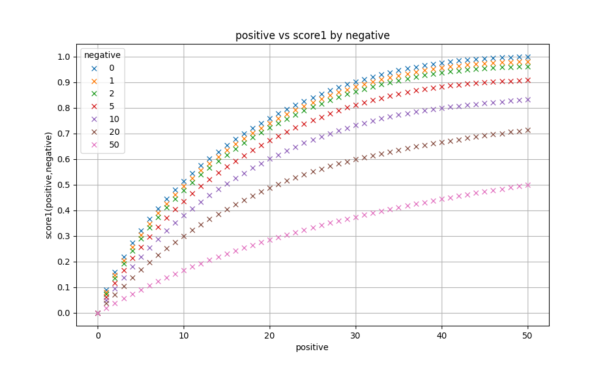

## 概要
queryの例は下記です。
`(ti:composition ((detd:coox detd:pearly) OR (clm:dye detd:behentrimoinium))) OR (cpc:A61Q5/12 detd:artichoke detd:genaminox) OR detd:amidoquatsagain`
- オペレーターは`AND`と`OR`のみを使用
  - `AND`は省略する (https://www.kaggle.com/competitions/uspto-explainable-ai/discussion/516104)
- すべてのフィールドを使用
- queryの形式は`subquery_1 OR subquery_2 OR ... OR subquery_k`。例示したqueryは下記の4つのsubqueryが含まれており、ひとつ目と二つ目は`ti:composition`をまとめてトークン数を節約している
  - `ti:composition detd:coox detd:pearly`
  - `ti:composition clm:dye detd:behentrimoinium`
  - `cpc:A61Q5/12 detd:artichoke detd:genaminox`
  - `detd:amidoquatsagain`
- validationには自前のsearcher (C++) と代替metricを使用

## 用語
- Result Set: クエリに対して、自前のsearcherで返却される特許のリスト。validation index中でクエリにマッチした全特許が返却される (50個に限定されない)
- AP'@50: コンペで使われた、AP@50のバグ込みの評価指標 (https://www.kaggle.com/competitions/uspto-explainable-ai/discussion/499981#2791642)
- Positive: ターゲットとなる50個の特許
- Negative: Positiveではないすべての特許。 テストindexに確実に含まれるかで二種類に分けられる
  - Certain Negative: test.csvに含まれるNegative特許 (~12K)
  - Potential Negative: patent_metadata.parquetに存在するがtest.csvに存在しない特許 (~13M)
- Padding: クエリにマッチする特許が50個未満の場合に追加される仮想的な特許

## Validation Strategy
https://www.kaggle.com/competitions/uspto-explainable-ai/discussion/501169 で議論されているように、patent_metadata.parquetに含まれるすべての特許を用いてクエリを作成できないかを考えました。
しかし、13M程度の特許すべてを含むWhooshのindexを作成するのは非現実的に思えたので、自前のsearcherと代替metricを用意し評価することにしました。
評価を高速で行えるよう、下記の制限を加えることにしました。
- 制限1: クエリにはproximity operatorを含まないものとする
- 制限2: クエリにマッチした特許間のスコアの重みづけはしない
- 制限3: クエリにはwildcardsを含まないものとする

制限1により特許中に登場する語の位置を考慮する必要がなくなり、制限2により特許中に登場する語の頻度を考慮する必要がなくなり、制限3により語の字面を考慮する必要がなくなります。

Result Set内にPositive(とPadding)のみが存在する場合、制限を加えた場合でも正確なAP'@50が計算できます。
例えばPositiveが0,10,20,30,40,50と変化するとAP'@50は0,0.51,0.76,0.91,0.97,1.0と変化します。

PositiveとNegativeが混在する場合はAP'@50を近似的にしか計算できません。
例えば、Positive1つとNegative1つ(とPadding48つ)の場合は図の2パターンの結果がありえます。

制限2により結果を1パターンに確定できないため、すべてのパターンが等確率に登場すると仮定しました。
この場合のAP'@50の近似スコアは`(0.090 + 0.070)/2 = 0.080`です。
同様に、Positive n個とNegative m個の場合、 $\binom{n+m}{m}$ パターンの結果がありえます。
すべてのパターンから復元抽出でランダムに選んだ100,000パターンのAP'@50の平均値をPositive n個、Negative m個の場合のスコアとしました(以後 $\text{score1}(n,m)$ とします)。

スコアをプロットしたグラフが下記です。

例えば $\text{score1}(25,0)=0.842$ 、 $\text{score1}(50,50)=0.500$ となります。

Result SetにPositiveとCertain Negativeしか含まれていない場合、 $\text{score1}$ をそのまま利用できます。

Result SetにPotential Negativeが含まれる場合はNegativeの数が確率的に変化します。
Positive n個、Potential Negative m個で、Potential Negativeはすべて確率pでResult Setに含まれるものと仮定します。
この場合、二項分布の確率質量関数(pmf)を使い、下記のようにスコアを計算できます。

$$
\text{score2}(n, m, p) = \sum_{k=0}^{m} \binom{m}{k} p^k (1-p)^{m-k} \text{score1}(n, k) 
$$

例えば$\text{score2(50,50,1.0) = 0.500}$、$\text{score2}(50,50,0.1)=0.910$, $\text{score2}(50,50,0.01)=0.990$となります。
例からもわかるように、$\text{score2}(n, m, 1.0)$は$\text{score1}(n, m)$と一致します。

validation scoreは、自前で作成したtest.csv相当の2500行それぞれで計算した$\text{score2(n, m, 0.2)}$の平均としました。
すべての特許の数は13M程度で、test indexに含まれうるPotential Negativeの数は75,000程度なので、$p=75000/13000000 ≒ 0.006$程度にすべきに思いましたが、それだとvalidation scoreが楽観的になりすぎたので、$p=0.2$としています。

test.csvのpublication_number相当は下記で用意しました
- 1975年以降かつcpc_codesがからではない特許から一様ランダムに選んだ2500特許

単純に1975年以降の特許で絞り込んでtest.csv相当を作成した場合、validation scoreとLB scoreがややずれているようにみえました。公開されているtrain indexやLBで分析した結果、train indexやLB計算に使われるtest.csvにはUS-Dから始まるデザイン特許が稀にしか含まれていないことに気づきました。
デザイン特許をいくつか調べてみるとcpc_codesが空なことが多かったため、`len(cpc_codes) > 0`の絞り込みを追加することにしました。
また、実際にcpc_codesが空となる特許がLBのtest.csvのpublication_numberの列に含まれていないことも確認しました。

上記で、LBスコアとvalidation scoreの差が概ね0.01以内に収まるようになりました。

## 解法
- Phase 0: 前処理
- phase 1: subqueryの候補を求める
- phase 2: 求めたsubqueryの候補を使い、`\text{score2}(n, m, 0.2)`が高くなるようビームサーチ

自前のsearcher同様、実行速度を早くしたかったので、すべてC++で実装しました。

### Phase 0: 前処理
- 同じ特許に複数回現れる単語は、whoosh_utils.pyで処理されたのと同じ方法でトークン化された後一つにまとめました
- ワイルドカードの文字を含む単語は除外しました
- すべての特許で一度しか現れない単語は除外しました
- 高頻度の単語は除外しました（例: titleで40万回、desriptionで1万回を超える頻度の単語）
- test.csvに現れない単語は除外しました
- 特許とすべての単語はIDに変換しました。その際、test.csvの特許のIDが小さくなるようにしました。これにより、Phase 1のconjunctive subqueryのDFSで効率の良い枝刈りが可能になります

### Phase 1: subqueryの候補の求め方
- n-shot subquery
  - 特定の一つの特許に確実に絞り込むためのsubquery
  - 例えば、titleに`margaric`を含むのは全特許中で`US-2023092870-A1`のみなので、`ti:margaric`は`US-2023092870-A1`のみに絞り込むことができます
  - 同様に、cpc_codesの`A46B13/005`と`A47L7/0061`がco-occurするのは全特許中で`US-2023025335-A1`のみなので、`cpc:A46B13/005 AND cpc:A47L7/0061`は`US-2023025335-A1`のみに絞り込むことができます
  - これは事前計算で埋め込みました
    - 手元で計算した結果patent_metadata.parquetに含まれる全13.3M個の特許のうち、1tokenで一つに絞れる特許は5.9M個、2tokenで一つに絞れる特許を追加で6.7M個程度見つけることができました
- conjunctive subquery
  - Positiveを複数含み、Certain Negativeがなく、Potential Negativeが$l$個以下となるsubquery
  - 2-3tokenを`AND`で結合したもの
    - cpc_codesすべて、titleとabstractの頻度400k以下、claimsの頻度100k以下、descriptionの頻度10k以下の語の組み合わせをDFSで探索しました
    - 大抵のケースは全探索できましたが、一部は時間がかかったので時間で打ち切っています
    - Certain Negativeは一つでも含まれるとスコアが大きく下がってしまうのと、後述のDFSの効率の良い枝刈りになったので含めないようにしました
  - Potential Negativeの数$l$は、$l=0$とした場合と$l=1$とした場合の2パターンでphase 2のビームサーチを実施しています。単に$l=1$とする場合よりもvalidation scoreが0.003程度高くなりました
  - これは事前計算せず、都度計算しています

### Phase 2: ビームサーチ
評価指標は$\text{score2}(n, m, 0.2)$で、使用したトークン数ごとに幅$W$のビームサーチをしました。
submission時は$W=100$にしました。$W$を増やせば多少validation scoreが向上しましたが、$W$を10倍にしてもvalidation scoreが0.001程度しか変わりませんでした。
また、subquery同士で共通のtokenが含まれる場合はまとめることで、使用するtoken数を節約しました。

例えばUS-7507696-B2に対するクエリは下記です。

`(ti:composition ((detd:coox detd:pearly) OR (clm:dye detd:behentrimoinium))) OR (cpc:A61Q5/12 detd:artichoke detd:genaminox) OR detd:amidoquatsagain`

上記は、13M程度の全特許に対して、US-7507696-B2のtargetの50個の特許のみにマッチする完璧なクエリです。
subqueryに分解すると4つです
- `ti:composition detd:coox detd:pearly`
- `ti:composition clm:dye detd:behentrimoinium`
- `cpc:A61Q5/12 detd:artichoke detd:genaminox`
- `detd:amidoquatsagain`

初めの三つのsubqueryはconjunctive subqueryで、ひとつ目と二つ目は`ti:composition`が共通なのでまとめられています。
最後の`detd:amidoquatsagain`はn-shot subqueryで、 US-8044007-B2のみにマッチします。

例示したクエリ同様に、全特許に対してtargetの50個のみにマッチする完璧なクエリを生成できた割合は6%程度ありました。

private scoreが一番良かったsubmissionでの$\text{score2}$の分布は下記です。

## 試さなかったものとうまくいかなかったもの
- `NOT`
  - `(subquery_a OR ...) NOT (subquery_b OR ...)`の形式で、まず荒く特許を絞り込んだ後`NOT`以降のsubqueryでNegativeを排除することでスコアを改善できそうに思いましたが、実装する暇がなく試せませんでした
- phase 2の他のメタ探索手法
  - 山登りや焼きなましによる候補の入れ替えも試しましたが、単にランダムに候補を入れ替えるだけではビームサーチに劣っていたのと、phase 2単体の改善を頑張ってもvalidation scoreが0.01未満しか改善しなそうだったのであまり深追いしていません
